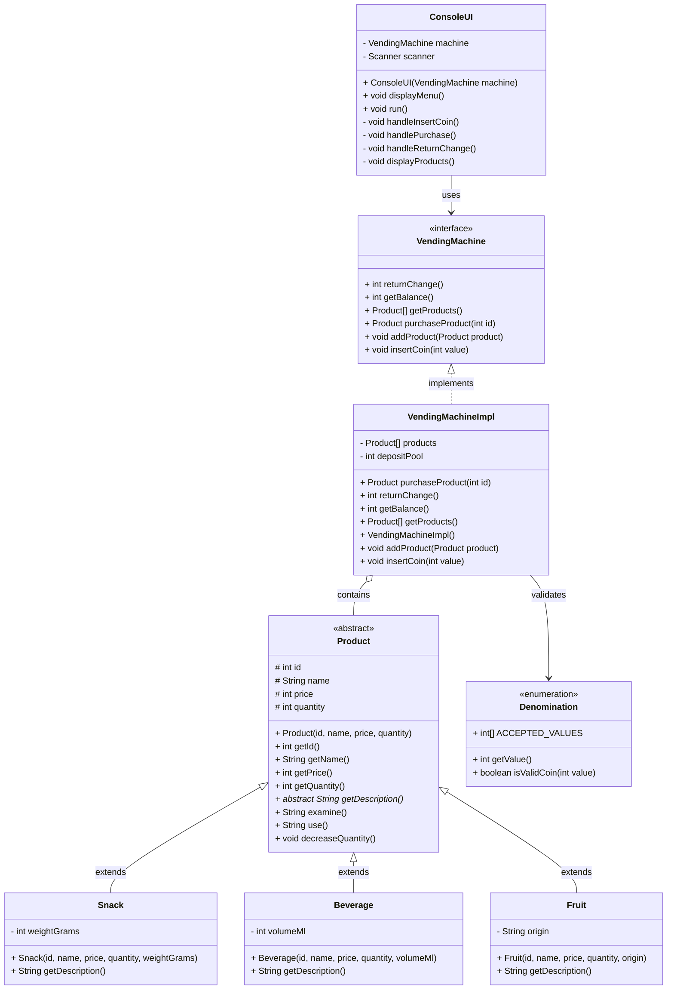
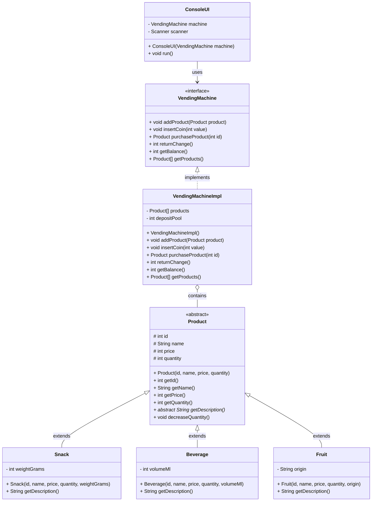

# Workshop — OOP Vending Machine

## Class Diagram

## Simplified Class Diagram (exercise-only)

## Relationships

| Relationship | Type | Description |
|---|---|---|
| `Product` ← `Snack/Beverage/Fruit` | Inheritance | Each product type extends the abstract `Product` base class |
| `Product` | Abstract | Cannot be instantiated directly — forces subclasses to implement `getDescription()` |
| `VendingMachine` ← `VendingMachineImpl` | Realization (Interface → Implementation) | All machine logic behind an interface for testability |
| `VendingMachineImpl` → `Product[]` | Composition | The machine owns an array of products |
| `ConsoleUI` → `VendingMachine` | Dependency | UI depends on the interface, not the implementation |
| `VendingMachineImpl` → `Denomination` | Dependency | Validates coin values against accepted denominations |
